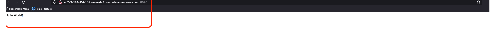

# Hello World EC2

A basic Flask web service hosted with AWS EC2

## Getting Started

This short tutorial will show you how to deploy this Dockerized Flask application on AWS EC2.

### Requirements
Please have the following installed:
- Docker (or Rancher or another alternative)
- Terraform
- AWS CLI
- Python 3.10

### Testing Locally

```bash
python app.py
```

The app will be live at localhost:8090

### Docker Image

Clone the github repository and build the docker image:

```bash
# note here that the prefix before the slash / is my repository username
docker build -t imohammd02/hello-world-ec2 .
```

Then, push the Docker image to a repository/registry of your choice. If you haven't used registries before, you can follow this link to learn more: https://docs.docker.com/docker-hub/repos/create/

In this example, I will be pushing to dockerhub:

```bash
docker login # follow the prompts to login
docker push docker push imohammd02/hello-world-ec2
```

### Testing Locally with docker image

```bash
docker run -d --name hello-world-ec2 -p 8090:8090 imohammd02/hello-world-ec2:latest
```

The app will be live at localhost:8090

### Deploying to AWS
We will be using terraform to create our hosting infrastructure (AWS ECS)

Change into the infra directory and set your AWS Credentials.
```bash
cd infra
# please note that this method of authenticating is not the best. You should always try to use IAM Role based authentication with AWS.
export AWS_ACCESS_KEY_ID=xxxx
export AWS_SECRET_ACCESS_KEY=xxxx
```

**IMPORTANT: Before we proceed with Terraform we need to change the local variables. In the locals.tf file you will find a few variables that you need to modify for your own infrastructure**

```hcl
locals {
  region           = "us-east-2"
  instance_name    = "hello-world-ec2"
  vpc_id           = "vpc-29571440" # change this to your own vpc id. Make sure the vpc allows public internet
  subnet_id        = "subnet-b71b48de" # change this to your own subnet. Make sure the subnet allows public traffic
  docker_repo_name = "imohammd02/hello-world-ec2" # you are welcome to use this image, but if you need to, change the image repo name here
}
```

Terraform Format and Initialize
```bash
terraform fmt
terraform init
```

Run Terraform validate to find any syntax errors:
```bash
terraform validate -no-color
```

Terraform Plan and Apply
```bash
terraform plan
# if the plan succeeds go ahead and apply. 
terraform apply
```

### Validation

Once the Terraform job completes, the output should contain a Public IP Address. You can visit the IP address and get an HTTP response. Please allow for 5-10 minutes for the instance to initialize. You can visit your application at http://<instance_public_ip>:8090

You can find my app hosted at: http://ec2-3-144-114-182.us-east-2.compute.amazonaws.com:8090/



## Roadmap

:white_check_mark: = Completed
:constrcuction:    = Incomplete

| Feature         | Status             |
|-----------------|--------------------|
| Terraform IaC   | :white_check_mark: |
| Application     | :white_check_mark: |
| Docker articact | :white_check_mark: |
| Documentation   | :white_check_mark: |
| Artifact CI     | :white_check_mark: |
| Artifact CD     | :construction:     |
| Terraform CI/CD | :construction:     |

